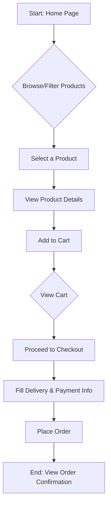

# User Flows

This document outlines the primary user flow for a customer purchasing a flower arrangement.

## Main User Flow: Ordering a Bouquet

This flow describes the 'happy path' from landing on the site to completing an order.

1.  **Landing:** User arrives at the Home Page, which displays a grid of featured flower arrangements.
2.  **Browsing:** User scrolls through the products or uses category filters to narrow down their search.
3.  **Selection:** User finds an appealing bouquet and clicks on it to navigate to the Product Detail Page.
4.  **Details & Add to Cart:** On the Product Detail Page, the user reviews the description, price, and images, then clicks the "Add to Cart" button.
5.  **View Cart:** The user clicks the cart icon in the header to open the shopping cart summary.
6.  **Proceed to Checkout:** After reviewing the cart, the user clicks "Proceed to Checkout."
7.  **Enter Information:** On the Checkout Page, the user fills in:
    *   Recipient's Name and Delivery Address
    *   Optional gift message
    *   Payment information (credit card details)
8.  **Place Order:** The user reviews the final order summary and clicks "Place Order."
9.  **Confirmation:** The user is redirected to an Order Confirmation page, which displays a success message and an order summary.

### Flowchart Diagram (Mermaid)

